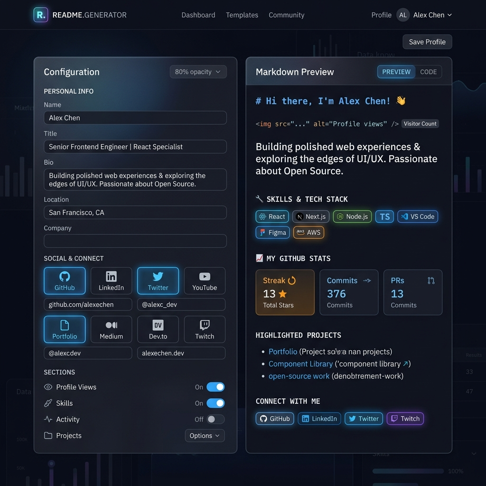

<div align="center">



# 🚀 Ultra-Premium GitHub Profile Generator

**A next-generation, glassmorphism-powered README generator designed to make your GitHub profile stand out.**

<div align="center">
  <h3>
    <a href="https://readme-generator-three-psi.vercel.app/">🔴 Live Demo</a>
    <span> | </span>
    <a href="https://github.com/karmaboy1309/readme-generator">💻 GitHub Repository</a>
  </h3>
</div>

[](https://reactjs.org/)
[](https://tailwindcss.com/)
[](https://vitejs.dev/)
[](https://opensource.org/licenses/MIT)

</div>

---

## 🌟 Overview

The **GitHub Profile Generator** is a sleek, modern, split-pane web application built for developers who want a stunning GitHub profile in seconds. Built on the MERN stack with **React** and **Tailwind CSS v4**, this tool offers a real-time markdown rendering experience wrapped in a beautiful, dark-themed glassmorphism UI.

Stop wasting time hand-coding Markdown. Simply fill out the interactive forms, select your tech stack from a visual grid, toggle your live Gitlyy stats, and instantly copy or download the generated `README.md`!

## ✨ Key Features

- **🎨 Glassmorphism Design:** A breathtaking, dark-themed UI with frosted glass panels and neon accents.
- **⚡ Real-time Live Preview:** Watch your GitHub profile come to life as you type, powered by `react-markdown` and `rehype-raw`.
- **🎛️ Interactive Tech Stack Grid:** Select your programming languages, frameworks, and tools from beautifully laid out, categorised grids.
- **🌐 Dynamic Social Links:** A cohesive card-based UI that automatically pulls official SVG icons for your social handles.
- **📊 Gitlyy Stats Integration:** Natively integrated with [Gitlyy](https://gitlyy.vercel.app/) to automatically generate real-time GitHub stat cards, top languages donuts, and contribution streaks.
- **📋 One-Click Export:** Instantly copy your generated markdown to your clipboard or download it directly as a `README.md` file.

---

## 🛠️ Tech Stack

- **Framework:** React 18 (via Vite)
- **Styling:** Tailwind CSS v4 (Custom Glassmorphism configuration)
- **Icons:** Lucide React & SimpleIcons & DevIcons
- **Markdown Rendering:** `react-markdown` & `rehype-raw`

---

## 🚀 Getting Started

Follow these instructions to run the generator on your local machine.

### Prerequisites

Ensure you have [Node.js](https://nodejs.org/) installed on your machine.

### Installation

1. **Clone the repository**
   ```bash
   git clone https://github.com/karmaboy1309/readme-generator.git
   cd readme-generator
   ```

2. **Install dependencies**
   ```bash
   npm install
   ```

3. **Start the development server**
   ```bash
   npm run dev
   ```

4. **Open your browser**
   Navigate to `http://localhost:5173` to see the magic happen!

---

## 📸 Screenshot

<div align="center">
  <a href="https://readme-generator-three-psi.vercel.app/">
    
  </a>
  <p><i>Live screenshot of the Ultra-Premium Profile Generator</i></p>
</div>

---

## 🤝 Contributing

Contributions, issues, and feature requests are always welcome! 
Feel free to check the [issues page](https://github.com/karmaboy1309/readme-generator/issues).

1. Fork the Project
2. Create your Feature Branch (`git checkout -b feature/AmazingFeature`)
3. Commit your Changes (`git commit -m 'Add some AmazingFeature'`)
4. Push to the Branch (`git push origin feature/AmazingFeature`)
5. Open a Pull Request

---

## 📝 License

Distributed under the MIT License. See `LICENSE` for more information.

<div align="center">
  Built with ❤️ by <a href="https://github.com/karmaboy1309">karmaboy1309</a>
</div>
